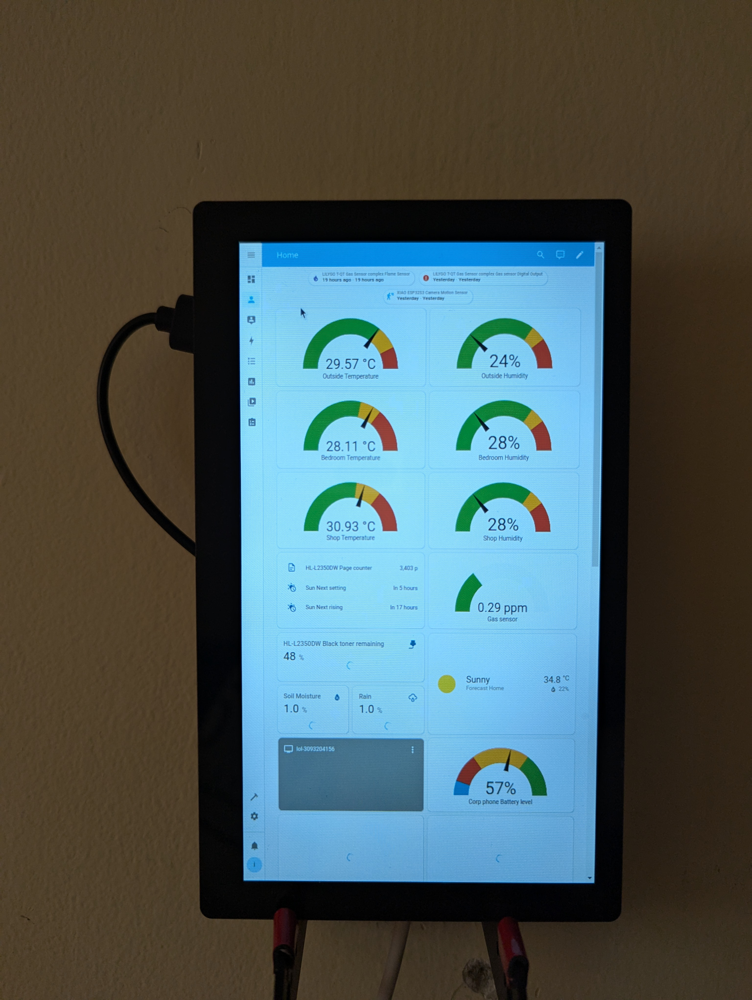

# My esphome projects

This repository contains my esphome projects. I use esphome to program my ESP8266 and ESP32 devices and integrate them with Home Assistant for a nice dashboard and automation.

## Dashboards




## Projects

1. Clock


```
LILYGO T-QT Pro                 Peripherals
+----------------+             +----------------+
|                |             |    GC9A01A     |
|         GPIO1  |------------>| RST            |
|         GPIO2  |------------>| MOSI           |
|         GPIO3  |------------>| CLK            |
|         GPIO5  |------------>| CS             |
|         GPIO6  |------------>| DC             |
|         GPIO12 |------------>| MISO           |
|                |             +----------------+
|                |
|     Button     |             +----------------+
|         GPIO16 |<------------| Button Input   |
|                |             +----------------+
|                |
|            3V3 |------------>| VCC            |
|            GND |------------>| GND            |
+----------------+
```

2. Climate sensor complex


```
LILYGO T-QT Pro                 Peripherals
+----------------+             +----------------+
|                |             |    GC9A01A     |
|         GPIO1  |------------>| RST            |
|         GPIO2  |------------>| MOSI           |
|         GPIO3  |------------>| CLK            |
|         GPIO5  |------------>| CS             |
|         GPIO6  |------------>| DC             |
|         GPIO12 |------------>| MISO           |
|                |             +----------------+
|                |
|                |             +----------------+
|         GPIO18 |------------>| SDA    AHT20   |
|         GPIO48 |------------>| SCL            |
|                |             +----------------+
|                |
|                |             +----------------+
|         GPIO16 |------------>| AO   Rain      |
|         GPIO34 |------------>| DO   Sensor    |
|                |             +----------------+
|                |
|                |             +----------------+
|         GPIO17 |------------>| AO   Soil      |
|         GPIO35 |------------>| DO   Moisture  |
|                |             +----------------+
|            3V3 |------------>| VCC (All)      |
|            GND |------------>| GND (All)      |
+----------------+
```

3. Seeedstudio XIAO Sentry


```
XIAO ESP32S3                    Peripherals
+----------------+             +----------------+
|     Camera     |             |    Camera      |
|         GPIO10 |------------>| XCLK          |
|         GPIO40 |------------>| SIOD          |
|         GPIO39 |------------>| SIOC          |
|         GPIO15 |------------>| D0            |
|         GPIO17 |------------>| D1            |
|         GPIO18 |------------>| D2            |
|         GPIO16 |------------>| D3            |
|         GPIO14 |------------>| D4            |
|         GPIO12 |------------>| D5            |
|         GPIO11 |------------>| D6            |
|         GPIO48 |------------>| D7            |
|         GPIO38 |------------>| VSYNC         |
|         GPIO47 |------------>| HREF          |
|         GPIO13 |------------>| PCLK          |
|                |             +----------------+
|                |
|     I2C Bus    |             +----------------+
|         GPIO21 |------------>| SDA    AHT20   |
|         GPIO7  |------------>| SCL            |
|                |             +----------------+
|                |
|    Audio I2S   |             +----------------+
|         GPIO9  |------------>| LRCLK/WS       |
|         GPIO8  |------------>| BCLK/SCK       |
|         GPIO20 |------------>| DIN    Mic     |
|                |             +----------------+
|                |
|  Motion Sensor |             +----------------+
|         GPIO2  |------------>| OUT  RCWL-0516 |
|         GPIO3  |------------>| VIN           |
|         GPIO4  |------------>| CDS           |
|                |             +----------------+
|            3V3 |------------>| VCC (All)      |
|            GND |------------>| GND (All)      |
+----------------+
```

4. Gas sensor complex


```
LILYGO T-QT Pro                 Peripherals
+----------------+             +----------------+
|                |             |    AHT20      |
|         GPIO38 |------------>| SDA           |
|         GPIO39 |------------>| SCL           |
|                |             +----------------+
|                |
|                |             +----------------+
|         GPIO18 |------------>| AO    MQ135   |
|         GPIO33 |------------>| DO    Gas     |
|                |             +----------------+
|                |
|                |             +----------------+
|         GPIO35 |------------>| DO    Flame   |
|                |             | Sensor        |
|                |             +----------------+
|            3V3 |------------>| VCC (All)     |
|            GND |------------>| GND (All)     |
+----------------+
```
